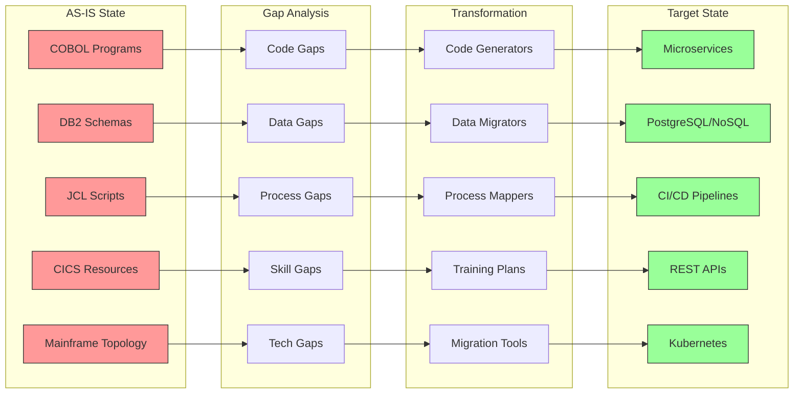

# Paywall Modernization Repository Structure

## Visual Tree Diagram

```mermaid
graph TD
    A[paywall-modernization/] --> B[source/]
    A --> C[tobe/]
    A --> D[gaps/]
    A --> E[transformation-assets/]
    
    B --> B1[bnf-grammar/]
    B --> B2[enterprise-architecture/]
    B --> B3[data-schema/]
    B --> B4[application-topology/]
    B --> B5[business-functions-processes/]
    B --> B6[skills/]
    B --> B7[organisation/]
    
    C --> C1[bnf-grammar/]
    C --> C2[enterprise-architecture/]
    C --> C3[data-schema/]
    C --> C4[application-topology/]
    C --> C5[business-functions-processes/]
    C --> C6[skills/]
    C --> C7[organisation/]
    
    D --> D1[bnf-grammar/]
    D --> D2[enterprise-architecture/]
    D --> D3[data-schema/]
    D --> D4[application-topology/]
    D --> D5[business-functions-processes/]
    D --> D6[skills/]
    D --> D7[organisation/]
    
    E --> E1[bnf-grammar/]
    E --> E2[enterprise-architecture/]
    E --> E3[data-schema/]
    E --> E4[application-topology/]
    E --> E5[business-functions-processes/]
    E --> E6[skills/]
    E --> E7[organisation/]
    
    style A fill:#f9f,stroke:#333,stroke-width:4px
    style B fill:#bbf,stroke:#333,stroke-width:2px
    style C fill:#bfb,stroke:#333,stroke-width:2px
    style D fill:#fbb,stroke:#333,stroke-width:2px
    style E fill:#fbf,stroke:#333,stroke-width:2px
```



## Hierarchical Structure

```
paywall-modernization/
├── README.md
├── .gitignore
│
├── source/                              # AS-IS Legacy System
│   ├── bnf-grammar/                    # Language syntax definitions
│   │   ├── cobol-grammar.bnf
│   │   ├── jcl-grammar.bnf
│   │   ├── cics-commands.bnf
│   │   └── db2-sql.bnf
│   │
│   ├── enterprise-architecture/        # System architecture
│   │   ├── system-context.json
│   │   ├── integration-points.xml
│   │   ├── deployment-topology.yaml
│   │   └── cics-resources/
│   │       ├── CICS_DEFINITIONS.jcl
│   │       └── PWREGMAP.bms
│   │
│   ├── data-schema/                    # Database and data structures
│   │   ├── db2_ddl_schema.sql
│   │   ├── data-dictionary.csv
│   │   ├── vsam-definitions.jcl
│   │   └── copybooks/
│   │       └── CUSTOMER-RECORD.cpy
│   │
│   ├── application-topology/           # Deployment and operations
│   │   ├── batch_registration_jcl.txt
│   │   ├── COMPILE_CUSTREG.jcl
│   │   ├── job-dependencies.json
│   │   ├── cics-definitions.txt
│   │   ├── network-config.txt
│   │   └── diagrams/
│   │       ├── system-overview.md
│   │       ├── cics-topology.md
│   │       └── batch-topology.md
│   │
│   ├── business-functions-processes/   # Business logic
│   │   ├── registration-rules.md
│   │   ├── process-flows.bpmn
│   │   ├── error-codes.properties
│   │   ├── cobol-programs/
│   │   │   └── CUSTREG.cbl
│   │   └── cics-programs/
│   │       └── PWREGCIC.cbl
│   │
│   ├── skills/                         # Human resources
│   │   ├── technical-skills-matrix.json
│   │   ├── training-requirements.md
│   │   └── knowledge-base-inventory.csv
│   │
│   └── organisation/                   # Team structure
│       ├── team-structure.json
│       ├── raci-matrix.csv
│       └── communication-plan.md
│
├── tobe/                               # Target Modern System
│   ├── bnf-grammar/                   # Modern language specs
│   ├── enterprise-architecture/       # Cloud architecture
│   │   ├── api-specs/
│   │   │   └── registration-api.yaml
│   │   ├── event-specs/
│   │   │   └── events.asyncapi.yaml
│   │   └── c4-model.puml
│   │
│   ├── data-schema/                   # Modern data models
│   ├── application-topology/          # Container orchestration
│   │   ├── kubernetes-manifests.yaml
│   │   └── diagrams/
│   │       ├── microservices-architecture.md
│   │       ├── event-driven-architecture.md
│   │       └── deployment-pipeline.md
│   │
│   ├── business-functions-processes/  # Modern business logic
│   ├── skills/                        # Required modern skills
│   └── organisation/                  # Target org structure
│
├── gaps/                              # Gap Analysis
│   ├── bnf-grammar/                  # Language transformation gaps
│   ├── enterprise-architecture/      # Architecture gaps
│   ├── data-schema/                  # Data migration gaps
│   ├── application-topology/         # Infrastructure gaps
│   ├── business-functions-processes/ # Process gaps
│   ├── skills/                       # Skills gaps
│   └── organisation/                 # Organizational change
│
└── transformation-assets/             # Reusable Tools
    ├── bnf-grammar/                  # Transpilers
    ├── enterprise-architecture/      # Migration patterns
    ├── data-schema/                  # Data mappers
    ├── application-topology/         # Deployment scripts
    ├── business-functions-processes/ # Process templates
    ├── skills/                       # Training materials
    └── organisation/                 # Change templates
```

## Artifact Flow Visualization



## Key Features

### 🔵 Source (AS-IS)
- Complete legacy mainframe implementation
- All COBOL, JCL, DB2, CICS artifacts
- Current team structure and skills
- Existing business processes

### 🟢 To-Be (Target)
- Modern cloud-native architecture
- Microservices, containers, APIs
- DevOps practices
- Updated skills requirements

### 🔴 Gaps
- Technical gaps between legacy and modern
- Skills that need development
- Process changes required
- Data transformation needs

### 🟣 Transformation Assets
- Reusable migration tools
- Code generation templates
- Training materials
- Best practices documentation

This structure enables AI-driven analysis by providing clear separation between current state, desired state, identified gaps, and transformation tools.
