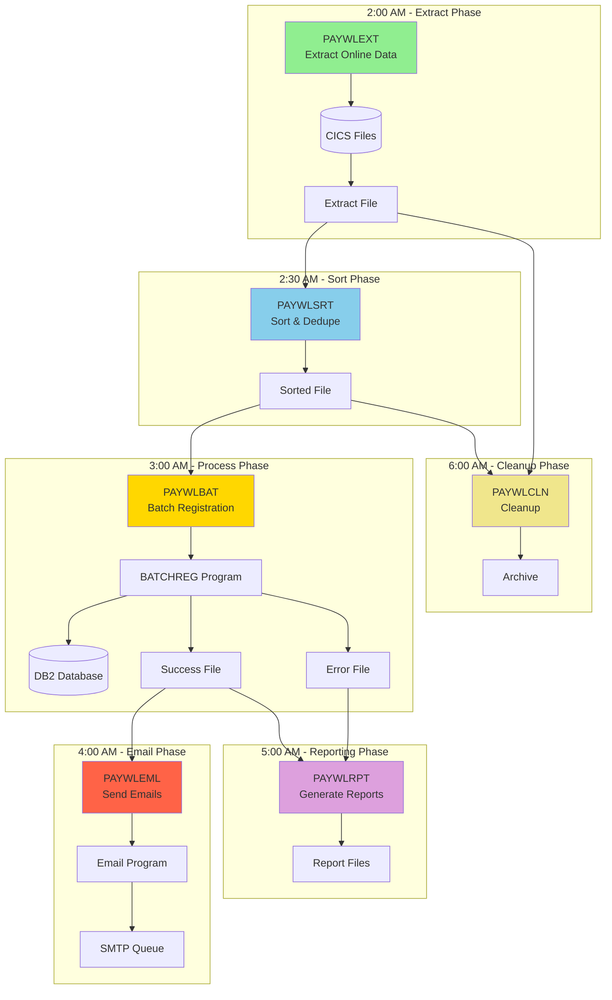

# Batch Processing Topology

## Daily Batch Job Flow

```mermaid
graph TD
    subgraph "2:00 AM - Extract Phase"
        JOB1[PAYWLEXT<br/>Extract Online Data]
        CICS[(CICS Files)]
        EXTRACT[Extract File]
        
        JOB1 --> CICS
        CICS --> EXTRACT
    end
    
    subgraph "2:30 AM - Sort Phase"
        JOB2[PAYWLSRT<br/>Sort & Dedupe]
        SORTED[Sorted File]
        
        EXTRACT --> JOB2
        JOB2 --> SORTED
    end
    
    subgraph "3:00 AM - Process Phase"
        JOB3[PAYWLBAT<br/>Batch Registration]
        BATCHREG[BATCHREG Program]
        DB2[(DB2 Database)]
        SUCCESS[Success File]
        ERROR[Error File]
        
        SORTED --> JOB3
        JOB3 --> BATCHREG
        BATCHREG --> DB2
        BATCHREG --> SUCCESS
        BATCHREG --> ERROR
    end
    
    subgraph "4:00 AM - Email Phase"
        JOB4[PAYWLEML<br/>Send Emails]
        EMAILBAT[Email Program]
        SMTP[SMTP Queue]
        
        SUCCESS --> JOB4
        JOB4 --> EMAILBAT
        EMAILBAT --> SMTP
    end
    
    subgraph "5:00 AM - Reporting Phase"
        JOB5[PAYWLRPT<br/>Generate Reports]
        REPORTS[Report Files]
        
        SUCCESS --> JOB5
        ERROR --> JOB5
        JOB5 --> REPORTS
    end
    
    subgraph "6:00 AM - Cleanup Phase"
        JOB6[PAYWLCLN<br/>Cleanup]
        ARCHIVE[Archive]
        
        EXTRACT --> JOB6
        SORTED --> JOB6
        JOB6 --> ARCHIVE
    end
    
    style JOB1 fill:#90EE90
    style JOB2 fill:#87CEEB
    style JOB3 fill:#FFD700
    style JOB4 fill:#FF6347
    style JOB5 fill:#DDA0DD
    style JOB6 fill:#F0E68C
```

## Job Dependencies (CA7/Control-M)

```mermaid
gantt
    title Daily Batch Schedule
    dateFormat HH:mm
    axisFormat %H:%M
    
    section Extract
    PAYWLEXT     :done, ext, 02:00, 30m
    
    section Sort
    PAYWLSRT     :done, srt, after ext, 20m
    
    section Process
    PAYWLBAT     :active, bat, after srt, 60m
    
    section Email
    PAYWLEML     :crit, eml, after bat, 45m
    
    section Report
    PAYWLRPT     :rpt, after bat, 30m
    
    section Cleanup
    PAYWLCLN     :cln, 06:00, 15m
```
