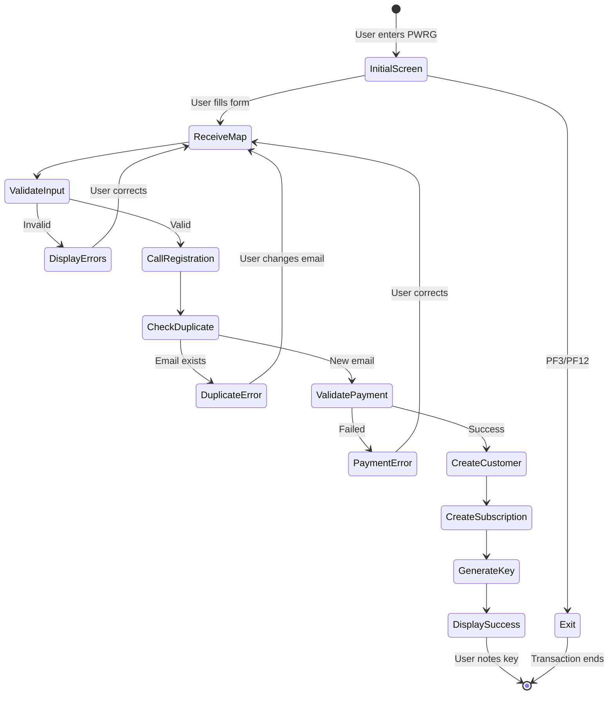
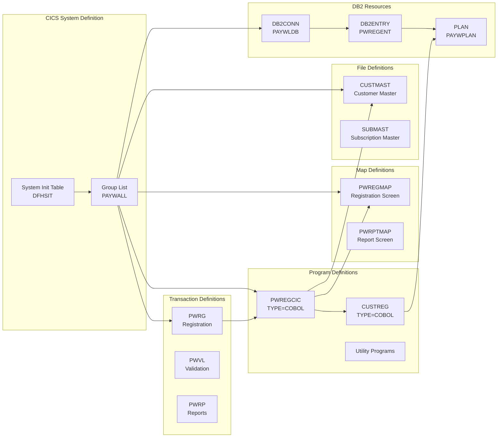

# CICS Transaction Flow

## Transaction PWRG Flow

```mermaid
stateDiagram-v2
    [*] --> InitialScreen: User enters PWRG
    
    InitialScreen --> ReceiveMap: User fills form
    InitialScreen --> Exit: PF3/PF12
    
    ReceiveMap --> ValidateInput
    ValidateInput --> DisplayErrors: Invalid
    ValidateInput --> CallRegistration: Valid
    
    DisplayErrors --> ReceiveMap: User corrects
    
    CallRegistration --> CheckDuplicate
    CheckDuplicate --> DuplicateError: Email exists
    CheckDuplicate --> ValidatePayment: New email
    
    DuplicateError --> ReceiveMap: User changes email
    
    ValidatePayment --> PaymentError: Failed
    ValidatePayment --> CreateCustomer: Success
    
    PaymentError --> ReceiveMap: User corrects
    
    CreateCustomer --> CreateSubscription
    CreateSubscription --> GenerateKey
    GenerateKey --> DisplaySuccess
    
    DisplaySuccess --> [*]: User notes key
    Exit --> [*]: Transaction ends
```

## CICS Resource Map

```mermaid
graph LR
    subgraph "CICS System Definition"
        SIT[System Init Table<br/>DFHSIT]
        GRPLIST[Group List<br/>PAYWALL]
    end
    
    subgraph "Transaction Definitions"
        PWRG[PWRG<br/>Registration]
        PWVL[PWVL<br/>Validation]
        PWRP[PWRP<br/>Reports]
    end
    
    subgraph "Program Definitions"
        PWREGCIC[PWREGCIC<br/>TYPE=COBOL]
        CUSTREG[CUSTREG<br/>TYPE=COBOL]
        UTILITY[Utility Programs]
    end
    
    subgraph "Map Definitions"
        PWREGMAP[PWREGMAP<br/>Registration Screen]
        PWRPTMAP[PWRPTMAP<br/>Report Screen]
    end
    
    subgraph "File Definitions"
        CUSTMAST[CUSTMAST<br/>Customer Master]
        SUBMAST[SUBMAST<br/>Subscription Master]
    end
    
    subgraph "DB2 Resources"
        DB2CONN[DB2CONN<br/>PAYWLDB]
        DB2ENTRY[DB2ENTRY<br/>PWREGENT]
        DB2PLAN[PLAN<br/>PAYWPLAN]
    end
    
    SIT --> GRPLIST
    GRPLIST --> PWRG
    GRPLIST --> PWREGCIC
    GRPLIST --> PWREGMAP
    GRPLIST --> CUSTMAST
    GRPLIST --> DB2CONN
    
    PWRG --> PWREGCIC
    PWREGCIC --> PWREGMAP
    PWREGCIC --> CUSTREG
    PWREGCIC --> CUSTMAST
    
    DB2CONN --> DB2ENTRY
    DB2ENTRY --> DB2PLAN
    CUSTREG --> DB2PLAN
```
