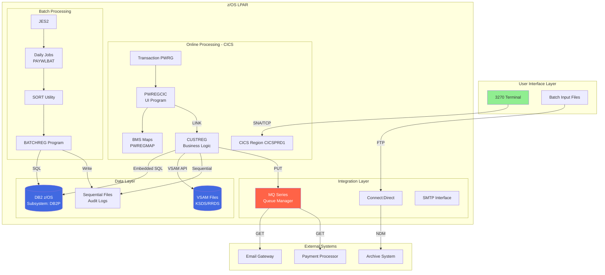
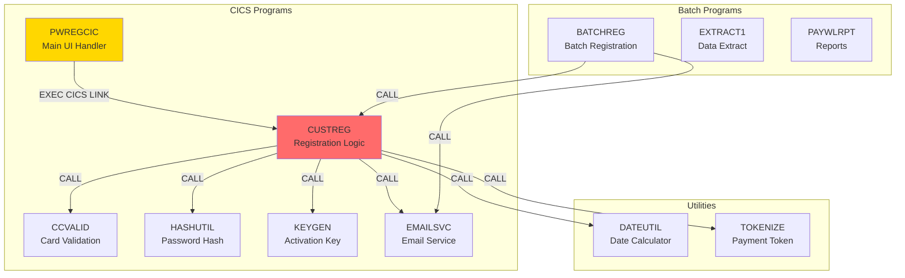
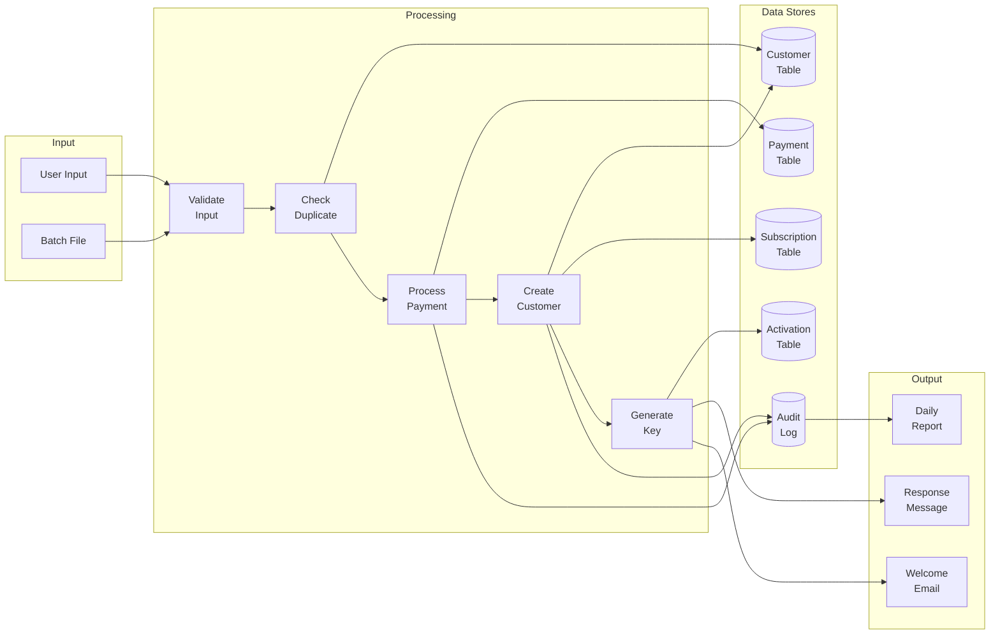

# Legacy Paywall System Overview

## System Architecture Diagram

```mermaid
graph TB
    subgraph "User Interface Layer"
        T3270[3270 Terminal]
        BatchIn[Batch Input Files]
    end
    
    subgraph "z/OS LPAR"
        subgraph "Online Processing - CICS"
            CICSREG[CICS Region CICSPRD1]
            TRAN[Transaction PWRG]
            PROG1[PWREGCIC<br/>UI Program]
            PROG2[CUSTREG<br/>Business Logic]
            BMS[BMS Maps<br/>PWREGMAP]
            
            TRAN --> PROG1
            PROG1 --> BMS
            PROG1 -->|LINK| PROG2
        end
        
        subgraph "Batch Processing"
            JES[JES2]
            JOBS[Daily Jobs<br/>PAYWLBAT]
            SORT[SORT Utility]
            BATCH[BATCHREG Program]
            
            JES --> JOBS
            JOBS --> SORT
            SORT --> BATCH
        end
        
        subgraph "Data Layer"
            DB2[(DB2 z/OS<br/>Subsystem: DB2P)]
            VSAM[(VSAM Files<br/>KSDS/RRDS)]
            SEQ[Sequential Files<br/>Audit Logs]
        end
        
        subgraph "Integration Layer"
            MQ[MQ Series<br/>Queue Manager]
            CONNECT[Connect:Direct]
            SMTP[SMTP Interface]
        end
    end
    
    subgraph "External Systems"
        EMAIL[Email Gateway]
        PAYMENT[Payment Processor]
        ARCHIVE[Archive System]
    end
    
    T3270 -->|SNA/TCP| CICSREG
    BatchIn -->|FTP| CONNECT
    
    PROG2 -->|Embedded SQL| DB2
    PROG2 -->|VSAM API| VSAM
    PROG2 -->|Sequential| SEQ
    
    BATCH -->|SQL| DB2
    BATCH -->|Write| SEQ
    
    PROG2 -->|PUT| MQ
    MQ -->|GET| EMAIL
    MQ -->|GET| PAYMENT
    
    CONNECT -->|NDM| ARCHIVE
    
    style T3270 fill:#90EE90
    style DB2 fill:#4169E1,color:#fff
    style VSAM fill:#4169E1,color:#fff
    style MQ fill:#FF6347,color:#fff
```

## Program Call Hierarchy

```mermaid
graph TD
    subgraph "CICS Programs"
        PWREGCIC[PWREGCIC<br/>Main UI Handler]
        CUSTREG[CUSTREG<br/>Registration Logic]
        CCVALID[CCVALID<br/>Card Validation]
        HASHUTIL[HASHUTIL<br/>Password Hash]
        KEYGEN[KEYGEN<br/>Activation Key]
        EMAILSVC[EMAILSVC<br/>Email Service]
    end
    
    subgraph "Batch Programs"
        BATCHREG[BATCHREG<br/>Batch Registration]
        EXTRACT1[EXTRACT1<br/>Data Extract]
        PAYWLRPT[PAYWLRPT<br/>Reports]
    end
    
    subgraph "Utilities"
        DATEUTIL[DATEUTIL<br/>Date Calculator]
        TOKENIZE[TOKENIZE<br/>Payment Token]
    end
    
    PWREGCIC -->|EXEC CICS LINK| CUSTREG
    CUSTREG -->|CALL| CCVALID
    CUSTREG -->|CALL| HASHUTIL
    CUSTREG -->|CALL| KEYGEN
    CUSTREG -->|CALL| EMAILSVC
    CUSTREG -->|CALL| DATEUTIL
    CUSTREG -->|CALL| TOKENIZE
    
    BATCHREG -->|CALL| CUSTREG
    BATCHREG -->|CALL| EMAILSVC
    
    style PWREGCIC fill:#FFD700
    style CUSTREG fill:#FF6B6B
```

## Data Flow Diagram

```mermaid
flowchart LR
    subgraph "Input"
        User[User Input]
        File[Batch File]
    end
    
    subgraph "Processing"
        Validate[Validate<br/>Input]
        Check[Check<br/>Duplicate]
        Payment[Process<br/>Payment]
        Create[Create<br/>Customer]
        Generate[Generate<br/>Key]
    end
    
    subgraph "Data Stores"
        CUST[(Customer<br/>Table)]
        SUB[(Subscription<br/>Table)]
        PAY[(Payment<br/>Table)]
        ACT[(Activation<br/>Table)]
        AUDIT[(Audit<br/>Log)]
    end
    
    subgraph "Output"
        Response[Response<br/>Message]
        Email[Welcome<br/>Email]
        Report[Daily<br/>Report]
    end
    
    User --> Validate
    File --> Validate
    
    Validate --> Check
    Check --> CUST
    Check --> Payment
    Payment --> PAY
    Payment --> Create
    Create --> CUST
    Create --> SUB
    Create --> Generate
    Generate --> ACT
    
    Create --> AUDIT
    Payment --> AUDIT
    
    Generate --> Response
    Generate --> Email
    AUDIT --> Report
```
