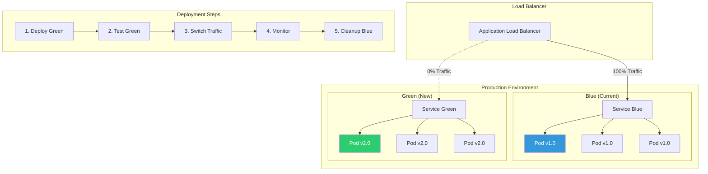
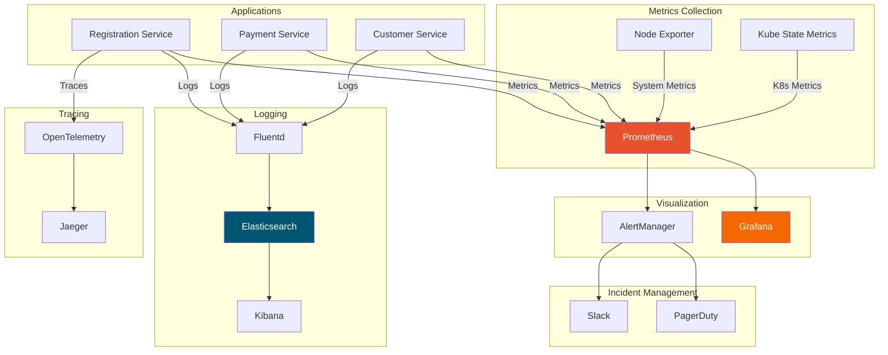

# CI/CD Pipeline Architecture

## GitOps Workflow

```mermaid
graph LR
    subgraph "Development"
        DEV[Developer]
        IDE[VS Code]
        LOCAL[Local Testing]
    end
    
    subgraph "Source Control"
        GIT[GitLab]
        BRANCH[Feature Branch]
        MR[Merge Request]
        MAIN[Main Branch]
    end
    
    subgraph "CI Pipeline"
        BUILD[Build]
        TEST[Test]
        SCAN[Security Scan]
        QUALITY[Code Quality]
        PACKAGE[Package]
    end
    
    subgraph "Container Registry"
        REGISTRY[GitLab Registry]
        IMAGES[Docker Images]
    end
    
    subgraph "CD Pipeline - ArgoCD"
        ARGO[ArgoCD]
        SYNC[Sync]
        DEPLOY[Deploy]
    end
    
    subgraph "Environments"
        DEV_ENV[Dev K8s]
        QA_ENV[QA K8s]
        STAGING[Staging K8s]
        PROD[Production K8s]
    end
    
    DEV --> IDE
    IDE --> LOCAL
    LOCAL --> BRANCH
    BRANCH --> MR
    MR --> MAIN
    
    MAIN --> BUILD
    BUILD --> TEST
    TEST --> SCAN
    SCAN --> QUALITY
    QUALITY --> PACKAGE
    PACKAGE --> REGISTRY
    
    REGISTRY --> ARGO
    ARGO --> SYNC
    SYNC --> DEPLOY
    
    DEPLOY --> DEV_ENV
    DEV_ENV --> QA_ENV
    QA_ENV --> STAGING
    STAGING --> PROD
    
    style GIT fill:#FC6D26
    style ARGO fill:#0DADEA
    style PROD fill:#2ECC71
```

## Blue-Green Deployment

```mermaid
graph TB
    subgraph "Load Balancer"
        ALB[Application Load Balancer]
    end
    
    subgraph "Production Environment"
        subgraph "Blue (Current)"
            BLUE1[Pod v1.0]
            BLUE2[Pod v1.0]
            BLUE3[Pod v1.0]
            BLUE_SVC[Service Blue]
        end
        
        subgraph "Green (New)"
            GREEN1[Pod v2.0]
            GREEN2[Pod v2.0]
            GREEN3[Pod v2.0]
            GREEN_SVC[Service Green]
        end
    end
    
    subgraph "Deployment Steps"
        STEP1[1. Deploy Green]
        STEP2[2. Test Green]
        STEP3[3. Switch Traffic]
        STEP4[4. Monitor]
        STEP5[5. Cleanup Blue]
    end
    
    ALB -->|100% Traffic| BLUE_SVC
    ALB -.->|0% Traffic| GREEN_SVC
    
    BLUE_SVC --> BLUE1
    BLUE_SVC --> BLUE2
    BLUE_SVC --> BLUE3
    
    GREEN_SVC --> GREEN1
    GREEN_SVC --> GREEN2
    GREEN_SVC --> GREEN3
    
    STEP1 --> STEP2
    STEP2 --> STEP3
    STEP3 --> STEP4
    STEP4 --> STEP5
    
    style BLUE1 fill:#3498DB,color:#fff
    style GREEN1 fill:#2ECC71,color:#fff
```

## Monitoring Stack

```mermaid
graph TB
    subgraph "Applications"
        APP1[Registration Service]
        APP2[Payment Service]
        APP3[Customer Service]
    end
    
    subgraph "Metrics Collection"
        PROM[Prometheus]
        NODE[Node Exporter]
        KUBE[Kube State Metrics]
    end
    
    subgraph "Logging"
        FLUENT[Fluentd]
        ELASTIC[Elasticsearch]
        KIBANA[Kibana]
    end
    
    subgraph "Tracing"
        JAEGER[Jaeger]
        OTEL[OpenTelemetry]
    end
    
    subgraph "Visualization"
        GRAFANA[Grafana]
        ALERT[AlertManager]
    end
    
    subgraph "Incident Management"
        PAGER[PagerDuty]
        SLACK[Slack]
    end
    
    APP1 -->|Metrics| PROM
    APP2 -->|Metrics| PROM
    APP3 -->|Metrics| PROM
    
    NODE -->|System Metrics| PROM
    KUBE -->|K8s Metrics| PROM
    
    APP1 -->|Logs| FLUENT
    APP2 -->|Logs| FLUENT
    APP3 -->|Logs| FLUENT
    
    FLUENT --> ELASTIC
    ELASTIC --> KIBANA
    
    APP1 -->|Traces| OTEL
    OTEL --> JAEGER
    
    PROM --> GRAFANA
    PROM --> ALERT
    
    ALERT --> PAGER
    ALERT --> SLACK
    
    style PROM fill:#E6522C,color:#fff
    style ELASTIC fill:#005571,color:#fff
    style GRAFANA fill:#F46800,color:#fff
```
