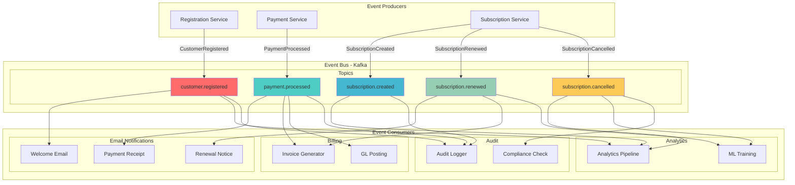
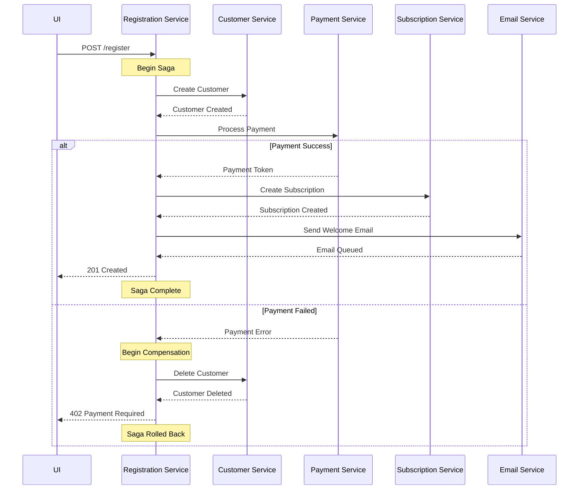
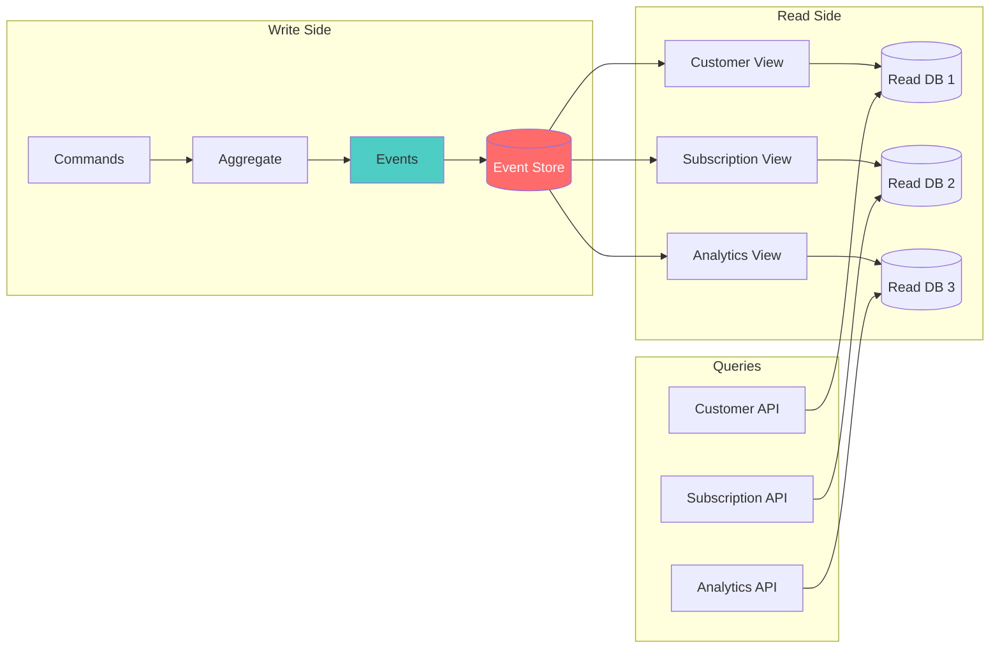

# Event-Driven Architecture

## Event Flow Diagram

```mermaid
graph TB
    subgraph "Event Producers"
        REG[Registration Service]
        PAY[Payment Service]
        SUB[Subscription Service]
    end
    
    subgraph "Event Bus - Kafka"
        subgraph "Topics"
            T1[customer.registered]
            T2[payment.processed]
            T3[subscription.created]
            T4[subscription.renewed]
            T5[subscription.cancelled]
        end
    end
    
    subgraph "Event Consumers"
        subgraph "Email Notifications"
            EMAIL1[Welcome Email]
            EMAIL2[Payment Receipt]
            EMAIL3[Renewal Notice]
        end
        
        subgraph "Analytics"
            ANALYTICS[Analytics Pipeline]
            ML[ML Training]
        end
        
        subgraph "Billing"
            INVOICE[Invoice Generator]
            LEDGER[GL Posting]
        end
        
        subgraph "Audit"
            AUDIT[Audit Logger]
            COMPLIANCE[Compliance Check]
        end
    end
    
    REG -->|CustomerRegistered| T1
    PAY -->|PaymentProcessed| T2
    SUB -->|SubscriptionCreated| T3
    SUB -->|SubscriptionRenewed| T4
    SUB -->|SubscriptionCancelled| T5
    
    T1 --> EMAIL1
    T1 --> ANALYTICS
    T1 --> AUDIT
    
    T2 --> EMAIL2
    T2 --> INVOICE
    T2 --> LEDGER
    T2 --> AUDIT
    
    T3 --> ANALYTICS
    T3 --> AUDIT
    
    T4 --> EMAIL3
    T4 --> INVOICE
    T4 --> ML
    
    T5 --> ANALYTICS
    T5 --> ML
    T5 --> COMPLIANCE
    
    style T1 fill:#FF6B6B
    style T2 fill:#4ECDC4
    style T3 fill:#45B7D1
    style T4 fill:#96CEB4
    style T5 fill:#FECA57
```

## Saga Pattern for Distributed Transactions

```mermaid
sequenceDiagram
    participant UI as UI
    participant REG as Registration Service
    participant CUST as Customer Service
    participant PAY as Payment Service
    participant SUB as Subscription Service
    participant EMAIL as Email Service
    
    UI->>REG: POST /register
    
    Note over REG: Begin Saga
    
    REG->>CUST: Create Customer
    CUST-->>REG: Customer Created
    
    REG->>PAY: Process Payment
    alt Payment Success
        PAY-->>REG: Payment Token
        
        REG->>SUB: Create Subscription
        SUB-->>REG: Subscription Created
        
        REG->>EMAIL: Send Welcome Email
        EMAIL-->>REG: Email Queued
        
        REG-->>UI: 201 Created
        
        Note over REG: Saga Complete
    else Payment Failed
        PAY-->>REG: Payment Error
        
        Note over REG: Begin Compensation
        
        REG->>CUST: Delete Customer
        CUST-->>REG: Customer Deleted
        
        REG-->>UI: 402 Payment Required
        
        Note over REG: Saga Rolled Back
    end
```

## Event Sourcing Pattern

```mermaid
graph LR
    subgraph "Write Side"
        CMD[Commands] --> AGG[Aggregate]
        AGG --> EVENTS[Events]
        EVENTS --> STORE[(Event Store)]
    end
    
    subgraph "Read Side"
        STORE --> PROJ1[Customer View]
        STORE --> PROJ2[Subscription View]
        STORE --> PROJ3[Analytics View]
        
        PROJ1 --> READ1[(Read DB 1)]
        PROJ2 --> READ2[(Read DB 2)]
        PROJ3 --> READ3[(Read DB 3)]
    end
    
    subgraph "Queries"
        API1[Customer API] --> READ1
        API2[Subscription API] --> READ2
        API3[Analytics API] --> READ3
    end
    
    style STORE fill:#FF6B6B,color:#fff
    style EVENTS fill:#4ECDC4
```
