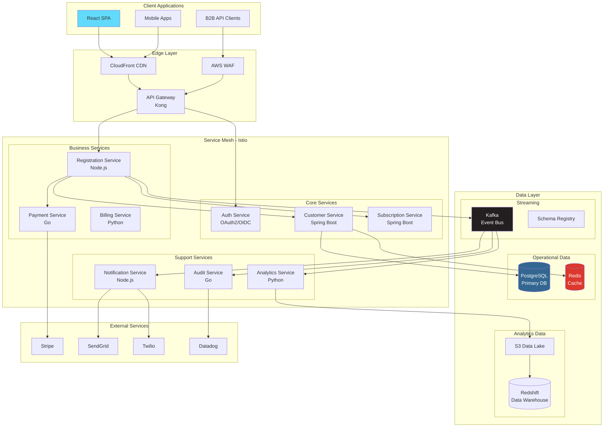
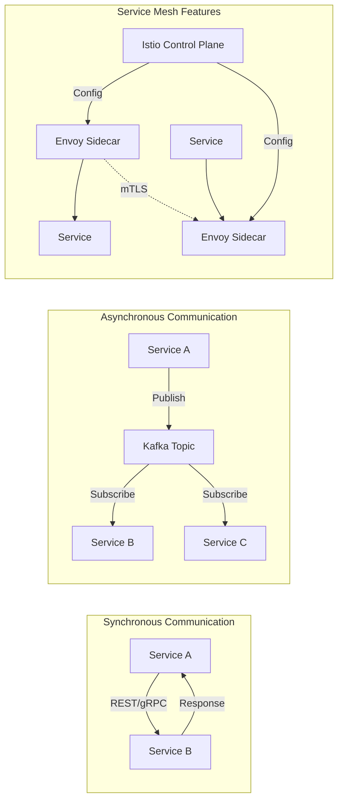
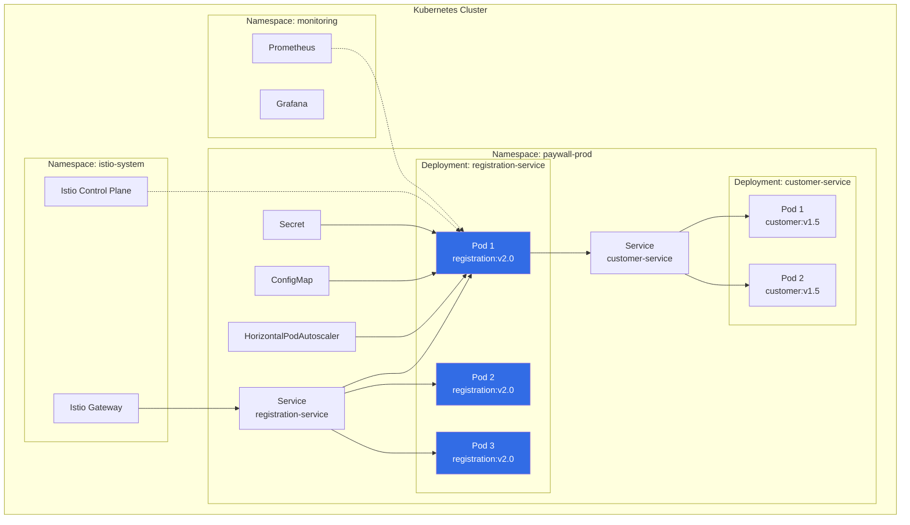

# Target Microservices Architecture

## High-Level Architecture

```mermaid
graph TB
    subgraph "Client Applications"
        WEB[React SPA]
        MOBILE[Mobile Apps]
        B2B[B2B API Clients]
    end
    
    subgraph "Edge Layer"
        CDN[CloudFront CDN]
        WAF[AWS WAF]
        APIGW[API Gateway<br/>Kong]
    end
    
    subgraph "Service Mesh - Istio"
        subgraph "Core Services"
            AUTH[Auth Service<br/>OAuth2/OIDC]
            CUSTOMER[Customer Service<br/>Spring Boot]
            SUBSCRIPTION[Subscription Service<br/>Spring Boot]
        end
        
        subgraph "Business Services"
            REGISTRATION[Registration Service<br/>Node.js]
            PAYMENT[Payment Service<br/>Go]
            BILLING[Billing Service<br/>Python]
        end
        
        subgraph "Support Services"
            NOTIFICATION[Notification Service<br/>Node.js]
            AUDIT[Audit Service<br/>Go]
            ANALYTICS[Analytics Service<br/>Python]
        end
    end
    
    subgraph "Data Layer"
        subgraph "Operational Data"
            POSTGRES[(PostgreSQL<br/>Primary DB)]
            REDIS[(Redis<br/>Cache)]
        end
        
        subgraph "Streaming"
            KAFKA[Kafka<br/>Event Bus]
            SCHEMA[Schema Registry]
        end
        
        subgraph "Analytics Data"
            S3[S3 Data Lake]
            REDSHIFT[(Redshift<br/>Data Warehouse)]
        end
    end
    
    subgraph "External Services"
        STRIPE[Stripe]
        SENDGRID[SendGrid]
        TWILIO[Twilio]
        DATADOG[Datadog]
    end
    
    WEB --> CDN
    MOBILE --> CDN
    B2B --> WAF
    
    CDN --> APIGW
    WAF --> APIGW
    
    APIGW --> AUTH
    APIGW --> REGISTRATION
    
    REGISTRATION --> CUSTOMER
    REGISTRATION --> SUBSCRIPTION
    REGISTRATION --> PAYMENT
    REGISTRATION --> KAFKA
    
    CUSTOMER --> POSTGRES
    CUSTOMER --> REDIS
    
    PAYMENT --> STRIPE
    
    KAFKA --> NOTIFICATION
    KAFKA --> AUDIT
    KAFKA --> ANALYTICS
    
    NOTIFICATION --> SENDGRID
    NOTIFICATION --> TWILIO
    
    ANALYTICS --> S3
    S3 --> REDSHIFT
    
    AUDIT --> DATADOG
    
    style WEB fill:#61DAFB
    style KAFKA fill:#231F20,color:#fff
    style POSTGRES fill:#336791,color:#fff
    style REDIS fill:#DC382D,color:#fff
```

## Service Communication Patterns

```mermaid
graph LR
    subgraph "Synchronous Communication"
        A1[Service A] -->|REST/gRPC| B1[Service B]
        B1 -->|Response| A1
    end
    
    subgraph "Asynchronous Communication"
        A2[Service A] -->|Publish| TOPIC[Kafka Topic]
        TOPIC -->|Subscribe| B2[Service B]
        TOPIC -->|Subscribe| C2[Service C]
    end
    
    subgraph "Service Mesh Features"
        PROXY1[Envoy Sidecar] --> SERVICE1[Service]
        SERVICE2[Service] --> PROXY2[Envoy Sidecar]
        PROXY1 -.->|mTLS| PROXY2
        
        CONTROL[Istio Control Plane]
        CONTROL -->|Config| PROXY1
        CONTROL -->|Config| PROXY2
    end
```

## Container Orchestration (Kubernetes)

```mermaid
graph TB
    subgraph "Kubernetes Cluster"
        subgraph "Namespace: paywall-prod"
            subgraph "Deployment: registration-service"
                POD1[Pod 1<br/>registration:v2.0]
                POD2[Pod 2<br/>registration:v2.0]
                POD3[Pod 3<br/>registration:v2.0]
            end
            
            SVC1[Service<br/>registration-service]
            
            subgraph "Deployment: customer-service"
                POD4[Pod 1<br/>customer:v1.5]
                POD5[Pod 2<br/>customer:v1.5]
            end
            
            SVC2[Service<br/>customer-service]
            
            HPA[HorizontalPodAutoscaler]
            CM[ConfigMap]
            SECRET[Secret]
        end
        
        subgraph "Namespace: istio-system"
            ISTIO[Istio Control Plane]
            GATEWAY[Istio Gateway]
        end
        
        subgraph "Namespace: monitoring"
            PROM[Prometheus]
            GRAF[Grafana]
        end
    end
    
    GATEWAY --> SVC1
    SVC1 --> POD1
    SVC1 --> POD2
    SVC1 --> POD3
    
    POD1 --> SVC2
    SVC2 --> POD4
    SVC2 --> POD5
    
    HPA --> POD1
    CM --> POD1
    SECRET --> POD1
    
    ISTIO -.-> POD1
    PROM -.-> POD1
    
    style POD1 fill:#326CE5,color:#fff
    style POD2 fill:#326CE5,color:#fff
    style POD3 fill:#326CE5,color:#fff
```
